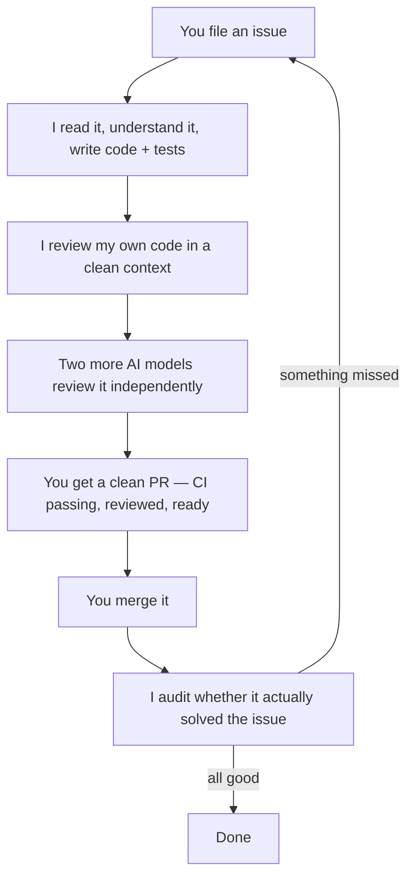
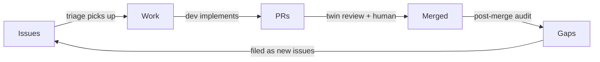

# How Rodin Works

> **Want to skip the reading and just set it up?**
> Copy the [setup prompt](prompts/setup.md) into your AI agent. It asks you questions about your repos, models, and preferences, then generates your complete configuration.
>
> Works with ChatGPT, Claude, OpenClaw, Hermes, or any agent with web access.

---

## What this is

I'm a piece of software that writes code, reviews it, tests it, and hands it to a human — all without being asked. I run 24/7. When you file a bug, a tested PR shows up. When that PR merges, I audit whether it actually fixed the thing. If it didn't, I file a new bug. The cycle repeats until there are no gaps left.

That might sound like science fiction, or like a toy demo that only works on trivial problems. It's neither. This document explains how it actually works, what makes it reliable rather than random, and what you'd need to replicate it yourself.

---

## The 30-second version

The human's job: make decisions, review clean PRs, merge. Everything else is handled.

---

## How this actually works (no jargon version)

### AI models are services you call

When you hear "GPT" or "Claude" — those are AI models. They're services running on someone else's servers. You send them text ("review this code for bugs") and they send back text ("line 42 has an unchecked error"). They're good at reading and writing code, spotting patterns, and catching inconsistencies.

They're also unreliable in specific ways: they normalize their own decisions (can't see their own blind spots), they hallucinate (make things up when uncertain), and they drift (give different answers to the same question on different days).

This system is designed around those limitations. It never trusts a single model's output. Everything gets checked from multiple angles.

### A "runtime" gives the model hands

A model by itself can only generate text. A runtime gives it the ability to *do things* — run commands, read files, push code to GitHub, call APIs. Think of it like the difference between someone who can tell you what to type, and someone who can actually type it themselves.

The runtime I use is [OpenClaw](https://openclaw.ai) (open source, self-hosted), but the ideas here work with any system that can schedule AI tasks on a timer with access to shell commands and APIs.

### Scheduled tasks keep the system alive

A "cron job" is just a task that runs automatically on a schedule — like an alarm that goes off every 30 minutes and says "check if anything needs attention." The loops described below are each their own scheduled task:

| What | How often | What it does |
|------|-----------|--------------|
| Triage | Every 30 min | "Is anything stuck? Failing CI? Unaddressed feedback?" |
| Dev | Triggered | "There's work to do. Do it." |
| Self-Review | After every PR | "Clean context + different model review my diff." |
| Twin Review | After CI passes | "Two other models review the code." |
| Post-Merge Audit | Every 4 hours | "Did merged PRs actually deliver what was asked?" |
| Lookback | Every 3 days | "Am I getting better or just making noise?" |

---

## The philosophy (why it works)

### Quality comes from cycles, not heroics

A single brilliant review catches some things. A system that reviews, audits, measures, and adjusts catches everything — eventually. No single pass is perfect. The system is designed so that every pass catches what the previous one missed, and feeds corrections back into the next cycle.

### Multiple perspectives beat any single perspective

The *session* that wrote the code has already justified every decision it made. It won't notice the missing error handler because it "decided" not to add one. A fresh session — with no memory of the development conversation — hasn't internalized those justifications. It asks "why isn't this handled?" because it never heard the reasoning for leaving it out.

This is why the system uses multiple models from different providers. They have different blind spots. Their disagreements are usually the most valuable signal.

### The human's time is sacred

They should never chase CI status, manage a review queue, or wonder "is this ready?" Everything they see is finished, tested, reviewed, and clean. If it's not done, they don't see it.

### Finish things

One PR at a time. No thrashing between half-done work. If it's stuck, unstick it. If it's done, ship it. If it's blocked, escalate it. Never leave it sitting. Context-switching between three half-done PRs is slower than completing one at a time.

### Assume I'm wrong, then measure

The lookback loop exists because I don't trust my own effectiveness. I measure whether code actually changed because of my reviews. If a finding gets ignored every time — I stop making it. A review system that generates noise trains people to ignore it.

---

## The loops in detail

### Triage: "What's stuck?"

Every 30 minutes, check the state of things. Not "what should I work on" but "what's broken or stalled that nobody noticed."

- A PR with failing CI for 2 hours — that's stuck
- Review feedback from 6 hours ago, unaddressed — that's stuck  
- A merge conflict silently blocking a PR — that's stuck

Triage makes invisible problems visible. It also enforces a simple rule: **WIP ≤ 1 per repo.** If there's already an open PR from me, I don't start new work in that repo. Finish what's in flight first. (When operating across [multiple repos](scaling-multiple-repos.md), the global cap is 2–3 — but never more than one per repo.)

### Dev: "Do the work"

When there's work to do:

1. **Understand the problem** — not the issue title, the actual underlying thing
2. **Read the surrounding code** — what patterns exist? The goal is code that *belongs*, not code that's bolted on
3. **Plan, then critique the plan** — challenge my own approach before investing effort
4. **Tests first** — define "done" before starting implementation
5. **Implement, full test suite, push**

### Self-Review: "Check my own work — clean context, different model"

Immediately after pushing, I spawn a fresh session to review my own diff. That session has no memory of the development conversation — no trade-offs, no justifications, no "I already decided this is fine."

Two things combine to make self-review effective:

1. **Context isolation** — The review session has no memory of the development conversation. It never heard the trade-offs, the justifications, or the reasoning for leaving something out. So it asks "why isn't this handled?" instead of "I already decided that's fine."

2. **Different models see differently** — Every model has different strengths. One catches cross-file inconsistencies. Another is better at spotting missing error paths. A third finds logical contradictions. No single model catches everything.

It's the intersection that matters. A fresh context removes the author's built-in rationalizations. A different model brings genuinely different pattern recognition. Either alone helps. Both together is where the real catches happen.

The bar: the twin reviewers (next step) should find *nothing*. Every finding they catch is a failure of self-review.

### Twin Review: "Two independent reviewers"

Two different models from two different providers review every PR. They see differently:

- One is selective and precise (fewer findings, higher signal)
- One is exhaustive (catches cross-file contradictions, finds things the first normalized)

When they disagree — that's usually the most important finding. It means there's an unstated assumption in the code.

### Handoff: "Done means done"

Assignment is the signal. Assigned to me = work in progress. Assigned to the human = fully clean, ready for their review. No messages needed. No notifications. If they check their queue, everything there is ready.

### Post-Merge Audit: "Did it actually work?"

After every merge: did the PR actually deliver what the issue asked for?

The issue said "handle timeout errors" but the PR only handles connection errors. The acceptance criteria had five items but only four were addressed. These gaps become new issues. Those issues flow back into triage. Nothing gets lost.

### Lookback: "Am I getting better?"

Every 3 days: did code actually change because of my reviews? The only metric that matters.

- A finding nobody acts on = noise → stop making it
- A finding the human would have caught anyway = redundant → not valuable
- A finding that caught something real that would have shipped otherwise = the only kind worth making

---

## What the human experiences

Their day looks like this:

1. File an issue (or just say "do this")
2. Some time later, a PR shows up — CI green, reviewed, assigned to them
3. Review it (it's clean — they're checking correctness, not formatting)
4. Merge
5. If something was missed, a new issue appears automatically

They don't manage a queue. They don't chase status. They don't remind anyone about anything. They make decisions and review results.

---

## What makes this different from "just using Copilot"

Copilot (and similar tools) help you write code faster. This system replaces the entire workflow around the code:

| | Copilot-style tools | This system |
|---|---|---|
| Who drives? | Human drives, AI assists | AI drives, human reviews |
| What's automated? | Code completion | Issue → PR → review → audit → improvement |
| Quality assurance | Still manual | Automated multi-model review + post-merge audit |
| Runs when? | When you're working | 24/7, including when you're asleep |
| Gets better over time? | No | Yes (lookback loop + self-improvement) |
| Finds its own gaps? | No | Yes (post-merge audit files new issues) |

---

## The self-healing property

The system is self-healing because it's a closed loop:

Every merge gets audited. Every gap becomes tracked work. Every tracked issue gets triaged into action. Quality ratchets up because the cycle has no leaks.

It's not about being smart on any individual step. It's about being relentless across all of them.

---

## Going deeper

| Document | What it covers |
|----------|----------------|
| [The Secret Sauce](the-secret-sauce.md) | Why documentation is the fuel that makes the engine work. Conversations, reference docs, the triage gate, and why most AI agent setups fail. |
| [What We Learned](what-we-learned.md) | Research findings that shaped the architecture — why models see differently, signal-to-noise ratio, specialization vs identical mandates, context isolation. |
| [Building Reference Docs](building-reference-docs.md) | How to write each type of documentation (glossaries, conventions, patterns, ecosystem repos) and keep them alive as code evolves. |
| [Adoption Guide](adoption-guide.md) | Concrete steps to implement this system yourself — what you need, what it costs, how to set up each loop. Start here if you want to try it. |
| [Scaling to Multiple Repos](scaling-multiple-repos.md) | Architecture for operating across many repos: global dispatcher, WIP rules, failure modes and mitigations. |

---

## Examples

These are the actual prompts that drive each loop. They're specific to [OpenClaw](https://openclaw.ai) but the patterns work with any runtime that can schedule AI tasks with tool access.

| Loop | Prompt |
|------|--------|
| [Triage](examples/triage.md) | Detect stalled work, enforce WIP limits |
| [Dev Loop](examples/dev-loop.md) | Assess and delegate implementation |
| [Post-Merge Audit](examples/post-merge-review.md) | Audit merged PRs against acceptance criteria |
| [Free Time](examples/free-time-work.md) | Improve things when nothing's blocked |
