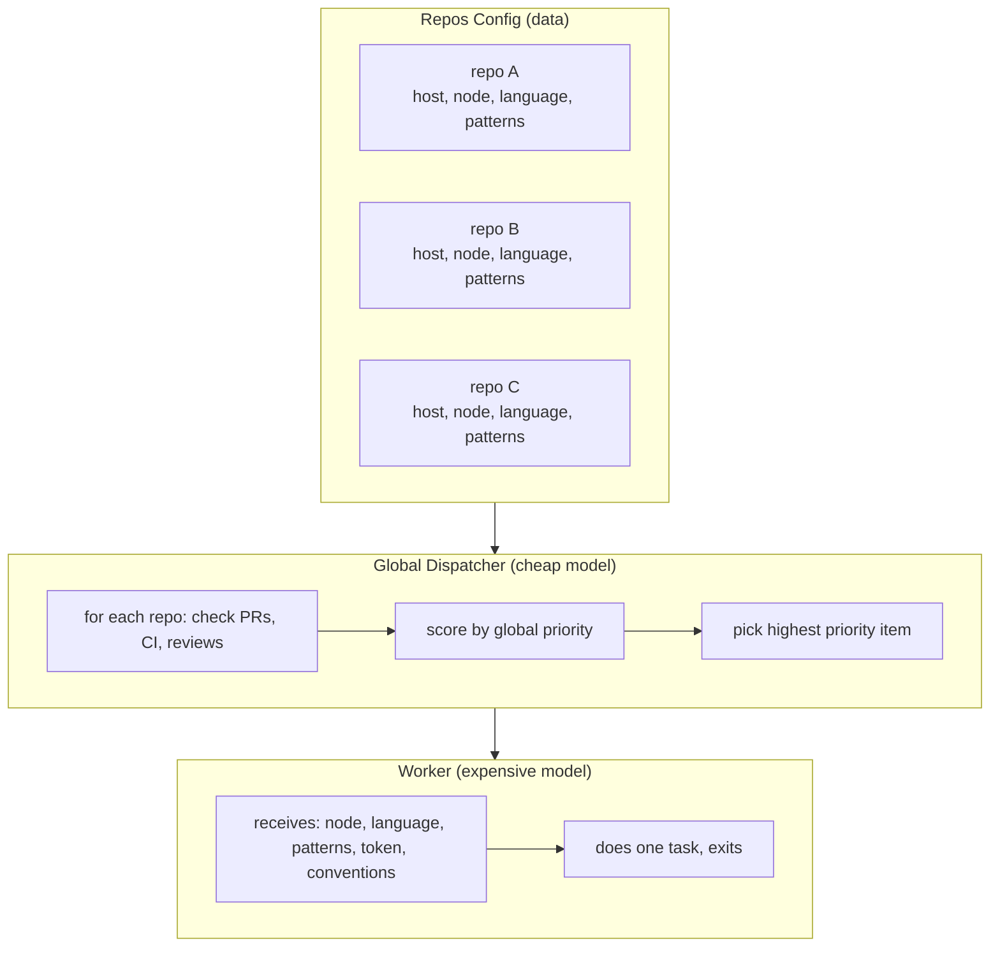

# Scaling to Multiple Repos

The system described in `how-i-work.md` runs against a single repo. Everything — URLs, tokens, node targets, language tooling, issue lists — is baked into cron job prompts. This works. But it doesn't scale.

This document describes what changes when you operate across 2, 5, or 20 repos simultaneously.

---

## What doesn't change

The loops stay the same. The philosophy stays the same. The priority order stays the same. You're still triaging, developing, self-reviewing, twin-reviewing, handing off, auditing, and measuring.

What changes is **where the knowledge lives** and **how the dispatcher routes**.

---

## The core problem

Single-repo: the dispatcher IS the config. URLs, tokens, conventions, and tooling are all in the prompt text.

Multi-repo: the dispatcher needs to be **generic**. It reads a config, iterates repos, picks the highest-priority item globally, then spawns a worker with the right context for that specific repo.

If you keep per-repo dispatchers, 5 repos × 7 loops = 35 cron jobs. Each one fires even when idle. Each one costs a dispatch call. Each one can't see the global picture. This doesn't work.

---

## Architecture: one dispatcher, many repos



---

## Repos config

The dispatcher needs structured knowledge about each repo. This can be a file it reads, an environment variable, or embedded in the prompt — but it must be data, not scattered prose.

```yaml
repos:
  - name: billing-service
    org: acme
    forge: gitea
    host: gitea.example.com
    api: https://gitea.example.com/api/v1
    default_branch: master
    node: build-server       # where to run tests/builds
    language: elixir
    patterns_repo: agent/elixir-patterns
    conventions: CONVENTIONS.md
    tokens:
      read: gitea-read-token
      write: gitea-write-token
    labels:
      ready: 32              # label ID for "ready" (Gitea uses IDs)
    ci_checks:               # expected CI job names
      - test
      - dialyzer
      - lint-docs

  - name: api-gateway
    org: acme
    forge: github
    host: github.com
    api: https://api.github.com
    default_branch: main
    node: cloud-dev          # different node for different repo
    language: go
    patterns_repo: agent/go-patterns
    conventions: CONTRIBUTING.md
    tokens:
      read: github-pat
      write: github-pat
    labels:
      ready: ready           # label name (GitHub uses names, not IDs)
    ci_checks:
      - build
      - test
      - lint

  - name: infra-tools
    org: acme-internal
    forge: github-enterprise
    host: github.corp.example.com
    api: https://github.corp.example.com/api/v3
    default_branch: main
    node: corp-dev
    language: go
    patterns_repo: agent/go-patterns
    conventions: null
    tokens:
      read: ghe-token
      write: ghe-token
    labels:
      ready: ready
    ci_checks:
      - ci

# How workers resolve tokens:
credentials_dir: ~/.agent/credentials  # cat $credentials_dir/<token-name>
```

The `credentials_dir` field tells workers where to find secrets. Each `tokens.read` / `tokens.write` value is a filename within that directory. No guessing, no env var hunting, no scattered secrets.

---

## WIP limits

Single-repo: WIP = 1, globally. Simple.

Multi-repo needs nuance:

| Rule | Why |
|------|-----|
| Max 1 open PR per repo | Prevents rebase hell within a repo |
| Max 2-3 open PRs globally | Prevents context-switching overload |
| Never 2 PRs in the same repo | The original anti-pattern — exponential rebases |

Parallel PRs across *different* repos are safe because they can't conflict with each other. The danger was always same-repo parallelism.

The dispatcher enforces this:
```
for each repo:
  count open PRs from me
  if count >= 1: skip this repo for new implementation work

total_open = sum of all open PRs from me
if total_open >= max_global_wip: skip all new implementation work
```

Fix/feedback work ignores WIP limits — you always fix broken things regardless of how many PRs are open.

---

## Priority: global, not per-repo

The priority order applies across all repos. A CI failure in repo C is more urgent than a NIT in repo A.

```
1. Merge conflicts      (any repo)
2. CI failures          (any repo)
3. Needs self-review    (any repo)
4. Unaddressed feedback (any repo)
5. Ready for handoff    (any repo)
6. New implementation   (respecting per-repo and global WIP)
```

Within the same priority level, prefer:
- Older items over newer (FIFO)
- Repos with more activity over quiet ones (momentum)
- Smaller tasks over larger ones (throughput)

---

## Workers stay stateless

Workers don't know about the multi-repo architecture. They receive:
- What to do
- Which node to exec on
- Which language/tooling to use
- Which patterns repo to consult
- Which token to use
- Which conventions file to read

They do one thing and exit. The dispatcher is the brain; workers are hands.

---

## Triage report: one view across all repos

Instead of per-repo triage reports, the human sees one unified view:

```
🔀 Triage — Friday May 8

billing-service:
  • #42 — payment retry logic | ✅ ready for merge
  • #44 — docs rebuild | ❌ gpt REQUEST_CHANGES

api-gateway:
  • #15 — health check retry | 🔄 CI running

infra-tools:
  (no open PRs)
```

One message. Everything at a glance. No need to check N different places.

---

## Issue tracker integration

Not every repo uses GitHub Issues. Many teams (especially enterprise) use Jira, Linear, or other external trackers. The system needs to handle this cleanly.

### Repos config: issue tracker field

```yaml
repos:
  - name: billing-service
    # ... forge, node, language, etc.
    issues:
      type: gitea             # issues live in the forge itself
      # no extra config needed

  - name: api-gateway
    issues:
      type: github
      # no extra config needed

  - name: infra-tools
    issues:
      type: jira
      url: https://jira.corp.example.com
      project: INFRA           # Jira project key
      token: jira-pat          # resolved via credentials_dir
      workflow:                # maps Jira statuses to loop states
        todo: "To Do"
        in_progress: "In Progress"
        review: "In Review"
        done: "Done"
```

### How Jira fits into each loop

**Triage:**
```
# GitHub/Gitea: scan open issues assigned to agent
GET /repos/:org/:repo/issues?assignee=agent&state=open

# Jira: JQL query
GET /rest/api/2/search?jql=project=INFRA AND assignee=currentUser() AND status="To Do"
```

The dispatcher normalizes both into the same shape: `{id, title, status, priority}`. It doesn't care where they came from.

**Dev loop (new implementation):**
When the dispatcher picks a Jira issue to implement:
- Read the Jira ticket (summary, description, acceptance criteria, subtasks)
- Transition to "In Progress" when work starts
- Worker's PR description links back: `Closes INFRA-123` or `Refs INFRA-123`
- Transition to "In Review" when PR is opened

**Post-merge review:**
This is where Jira integration matters most. The auditor needs to:
1. Find the linked Jira issue from the PR (parse `PROJ-123` from branch name, commit messages, or PR body)
2. Pull acceptance criteria from the Jira ticket (description, subtasks, custom fields)
3. Compare: did the merged code deliver each criterion?
4. If gaps: create a new Jira issue (type=Bug, links to original) or comment on the original

```
# Find linked issue from PR
branch: fix/INFRA-123-retry-logic  →  INFRA-123
commit: "fix(INFRA-123): add retry"  →  INFRA-123
PR body: "Closes INFRA-123"  →  INFRA-123

# Pull acceptance criteria
GET /rest/api/2/issue/INFRA-123?fields=description,subtasks,customfield_10100

# File gap issue
POST /rest/api/2/issue
{
  "fields": {
    "project": {"key": "INFRA"},
    "issuetype": {"name": "Bug"},
    "summary": "Gap: INFRA-123 missing retry on 503",
    "description": "Post-merge audit found...",
    "issuelinks": [{"type": "Relates", "inwardIssue": {"key": "INFRA-123"}}]
  }
}
```

**Handoff:**
When a PR is ready for human review, optionally transition the Jira issue to "In Review" and add a comment with the PR link. The human sees the PR in their code forge AND the ticket moves in their Jira board.

### Linking conventions

Pick one pattern and enforce it:

| Convention | Example | Detection regex |
|------------|---------|----------------|
| Branch prefix | `fix/INFRA-123-description` | `(?:fix\|feat\|chore)/([A-Z]+-\d+)` |
| Commit prefix | `fix(INFRA-123): description` | `\(([A-Z]+-\d+)\)` |
| PR body | `Closes INFRA-123` | `(?:Closes\|Refs\|Fixes)\s+([A-Z]+-\d+)` |

The dispatcher should try all three in order. If none match, the PR is orphaned (no linked issue) — flag this in triage as a process problem.

### What Jira gives you that forge issues don't

- **Custom fields:** acceptance criteria, story points, sprint membership
- **Workflow transitions:** automatic status updates as work progresses
- **Cross-project visibility:** a single board showing work across repos
- **Approval flows:** some teams require Jira approval before merge

### What Jira complicates

- **Two sources of truth:** issue is in Jira, code is in GitHub. They can drift.
- **API authentication:** Jira Cloud uses OAuth or API tokens. Jira Server uses PATs or basic auth. Different endpoints.
- **Rate limits:** Jira Cloud has aggressive rate limiting. Batch your queries.
- **Status sync:** if the agent transitions issues automatically, make sure it matches the team's workflow. Don't move a ticket to "Done" just because a PR merged — some teams need QA sign-off first.

### Minimal Jira integration (start here)

If full bidirectional sync feels heavy, start with:
1. **Read-only triage:** query Jira for assigned issues, include them in priority ranking
2. **Link detection:** parse PR branches/commits for ticket IDs, include in triage report
3. **Post-merge audit:** pull acceptance criteria from Jira, compare to merged diff

Add write operations (transitions, comments, new issues) only after read-only is working reliably.

---

## Forge abstraction

Different forges have different APIs:

| Operation | Gitea | GitHub | GitHub Enterprise |
|-----------|-------|--------|-------------------|
| List PRs | `/repos/:org/:repo/pulls` | `/repos/:owner/:repo/pulls` | Same as GitHub |
| CI status | `/repos/.../commits/:sha/status` | `/repos/.../commits/:sha/status` | Same |
| Reviews | `/repos/.../pulls/:n/reviews` | `/repos/.../pulls/:n/reviews` | Same |
| Assign | PATCH `/pulls/:n` with `assignees` | Same | Same |
| Add label | POST `/issues/:n/labels` with `[id]` | POST `/issues/:n/labels` with `["name"]` | Same as GitHub |

The meaningful difference: Gitea labels use IDs, GitHub labels use names. Everything else is close enough that the dispatcher can handle it with a `forge` field switch.

---

## Self-review model rotation

With multiple repos in different languages, self-review model selection can be smarter:

| Dev model | Self-review model | Why |
|-----------|-------------------|-----|
| Opus | Sonnet | Different architecture finds different things |
| GPT-5 | Opus | Cross-provider catches normalized assumptions |
| Sonnet | GPT-5 | Ditto |

Rule: self-review must always use a different model family than whatever wrote the code. "Different model" means different provider or different architecture — not just a different size of the same model.

---

## Lookback scales naturally

The lookback loop already works per-PR. With multiple repos, it just has more data:

- Track per-model AND per-repo effectiveness
- "Sonnet finds more in Elixir than Go" → useful signal
- "GPT-5 catches more in Go concurrency" → useful signal
- Per-repo noise scores reveal which review prompts need tuning for which language

---

## Cron job count: before and after

**Before (per-repo approach for 3 repos):**
- 3 triage jobs
- 3 dev-loop jobs
- 3 post-merge review jobs
- 1 free-time job
- 1 lookback job
- **Total: 11 cron jobs**

**After (global dispatcher approach for 3 repos):**
- 1 triage job (scans all repos)
- 1 dev-loop job (scans all repos, spawns one worker)
- 1 post-merge review job (scans all repos)
- 1 free-time job (picks from any repo)
- 1 lookback job (analyzes all repos)
- **Total: 5 cron jobs**

Same coverage, less overhead, global WIP enforcement built in.

---

## Migration path

You don't rewrite everything at once:

1. **Week 1:** Add repos config file. Dispatcher reads it but still only operates on repo[0].
2. **Week 2:** Extend triage to scan all repos. Dev-loop still single-repo.
3. **Week 3:** Extend dev-loop to route workers to any repo based on priority.
4. **Week 4:** Remove per-repo cron jobs, run fully global.

At each step, the system still works for the original repo. You're adding capability, not replacing it.

---

## What to watch for

**Token sprawl.** Each repo × each forge × each operation = potentially many tokens. The config references token names (`gitea-write`, `github-pat`), but workers need to know *how to resolve them*. Define a consistent convention:

```yaml
# Option A: file-based (recommended)
# All tokens live in a known directory. Workers resolve by:
#   cat $CREDENTIALS_DIR/<token-name>
credentials_dir: ~/.agent/credentials

# Option B: environment variables
# Workers resolve by:
#   $GITEA_WRITE_TOKEN, $GITHUB_PAT, etc.
credentials_source: env
credentials_prefix: AGENT_  # → AGENT_GITEA_WRITE, AGENT_GITHUB_PAT
```

Pick one. Document it in the config. Never leave workers guessing where secrets live — that's how you get a dispatcher that references `ghe-token` and a worker that can't find it.

**Node contention.** If two repos target the same node, workers can collide (disk space, port conflicts, test databases). This causes weird intermittent failures that are hard to debug later.

Solve this early, not later:

```yaml
nodes:
  build-server:
    max_concurrent_workers: 1   # serialize work on this node
    test_isolation: docker       # or: unique-db-per-run, tmpdir
  cloud-dev:
    max_concurrent_workers: 2
    test_isolation: unique-db-per-run
```

If `max_concurrent_workers: 1`, the dispatcher won't spawn a second worker targeting that node while one is already running. If you can't enforce isolation at the node level, at least ensure each worker uses a unique working directory (worktrees help here — `worktrees/pr-<N>` never collides with `worktrees/pr-<M>`).

Test databases specifically: either use a unique DB name per worker (`myapp_test_<PID>`), run tests in Docker with ephemeral containers, or serialize. Don't discover this problem at 2am when two workers stomp each other's test data.

**Context budget.** The dispatcher prompt grows with each repo. Keep the repos config compact — the dispatcher only needs enough to assess state. Workers get the full context.

**Heterogeneous forges.** GitHub, Gitea, GitLab, Bitbucket — each has quirks. Abstract the 5-6 operations you actually need (list PRs, get CI, get reviews, assign, label, comment) rather than trying to support every API endpoint.

**Different human reviewers.** With multiple repos, handoff might go to different people. Add a `handoff_to` field in the repos config rather than hardcoding one assignee.

---

## Failure modes and mitigations

The multi-repo architecture introduces failure modes that don't exist in per-repo setups. Address these before they bite.

### Dispatcher is a single point of failure

The whole system routes through one cron job. If it fails — model timeout, rate limit, network blip — nothing happens across any repo. The per-repo approach was inefficient but resilient.

**Mitigation:**
- Track consecutive dispatcher failures. If N consecutive runs fail (e.g., 3), alert the human.
- Health endpoint or heartbeat monitor that specifically checks "has the dispatcher fired successfully in the last 2× its interval?"
- Consider a fallback: if the dispatcher hasn't run in 2 hours, a simpler per-repo check (just CI status) fires as a degraded backup.

```yaml
health:
  dispatcher_max_consecutive_failures: 3
  alert_if_silent_for: 2h
  fallback: per_repo_ci_check   # degraded mode, not full dispatch
```

### Stale handoff deadlock

WIP limits block new work when a PR is open. But what if the human never reviews it? A PR that sits for a week means that repo is frozen. No work happens because WIP=1 and the slot is occupied by something nobody is looking at.

**Mitigation:**
- Track time-since-handoff. If a PR has been assigned to the human for >48h with no activity (no comments, no merge, no rejection), escalate:
  1. First: ping the reviewer ("PR #42 has been waiting 48h")
  2. After 72h: reduce that PR's WIP weight to 0.5 (allow new work to start in that repo)
  3. After 1 week: auto-mark as stale, fully release the WIP slot
- The human can also explicitly say "I'll get to this later" — that resets the clock.

```yaml
stale_thresholds:
  ping_reviewer_after: 48h
  reduce_wip_weight_after: 72h
  release_wip_slot_after: 168h   # 1 week
```

### Gap loop has no circuit breaker

Post-merge review finds gaps → files new issues → triage picks them up → dev loop implements them → post-merge finds more gaps. A strict auditor could generate work indefinitely. This is a runaway feedback loop.

**Mitigation:**
- Gap issues filed by post-merge review are tagged differently (e.g., `audit-gap` label or specific issue type).
- The triage gate DOES NOT auto-assign audit-gap issues. They require human triage before becoming eligible for the dev loop.
- The human decides: "yes, fix this" (assigns to agent) or "not worth it" (closes the issue).
- Rate limit: post-merge review files at most 3 gap issues per run. If it finds more, it batches them into one summary issue for the human to break apart.

```
post_merge_review:
  gap_issues_require_human_triage: true
  max_gaps_per_run: 3
  overflow_behavior: batch_into_summary
```

This is critical. Without this gate, the system can create infinite work from finite merges. The human must remain the arbiter of what's worth fixing.

### Lookback self-modification risk

The lookback loop identifies noisy patterns and recommends prompt changes. But should it *apply* those changes autonomously?

**Answer: no.** Lookback RECOMMENDS changes. A human approves them.

- Lookback writes recommendations to a file or posts them in a report
- The human reviews and either applies the change or dismisses it
- The agent never modifies its own review prompts without human sign-off

Self-modification of the review system is a meaningful capability change. Getting it wrong means the system could silence legitimate findings or amplify noise. This needs human oversight.

### Momentum tiebreaker starves quiet repos

Within the same priority level, preferring active repos over quiet ones means a quiet repo could wait forever for free-time work. The active repo always wins because it always has more "momentum."

**Mitigation:** Replace momentum with **longest-since-last-touch.** The repo that hasn't received attention in the longest time gets priority. This naturally round-robins across repos during free time while still allowing urgency to override.

```
tiebreaker_for_same_priority:
  1. longest_since_last_agent_activity   # prevents starvation
  2. smaller_task_first                   # throughput
  3. alphabetical                         # deterministic fallback
```

### CI outage vs code failure are indistinguishable

If CI infrastructure goes down, every repo shows CI failures. The dispatcher will prioritize them all urgently and spawn workers that try to "fix" code that isn't broken.

**Mitigation:**
- If ALL PRs across ALL repos show CI failures simultaneously, that's almost certainly infrastructure, not code. The dispatcher should detect this pattern and:
  1. Skip CI-failure priority for this run
  2. Alert the human: "CI appears to be down globally (N/N PRs failing)"
  3. Wait for next run to re-check
- Single-repo CI failure = likely code problem. Cross-repo simultaneous CI failure = likely infrastructure.
- Additionally: check if CI even *ran* (pending vs failed). Infrastructure outages often show as "pending" (never started) rather than "failed" (ran and broke).

```
ci_outage_detection:
  threshold: all_repos_failing  # or >80% of PRs failing simultaneously
  action: skip_and_alert
  distinguish: pending_vs_failed  # pending = infra, failed = code
```

---

## Summary

Single-repo is prompt-as-config. Multi-repo is config-as-data with a generic dispatcher.

The loops don't change. The philosophy doesn't change. The priority system doesn't change. What changes is that the dispatcher becomes a router — it reads structured data about all repos, picks the globally highest priority item, and spawns a worker with the right context.

One brain, many hands, shared priorities, no duplication.
