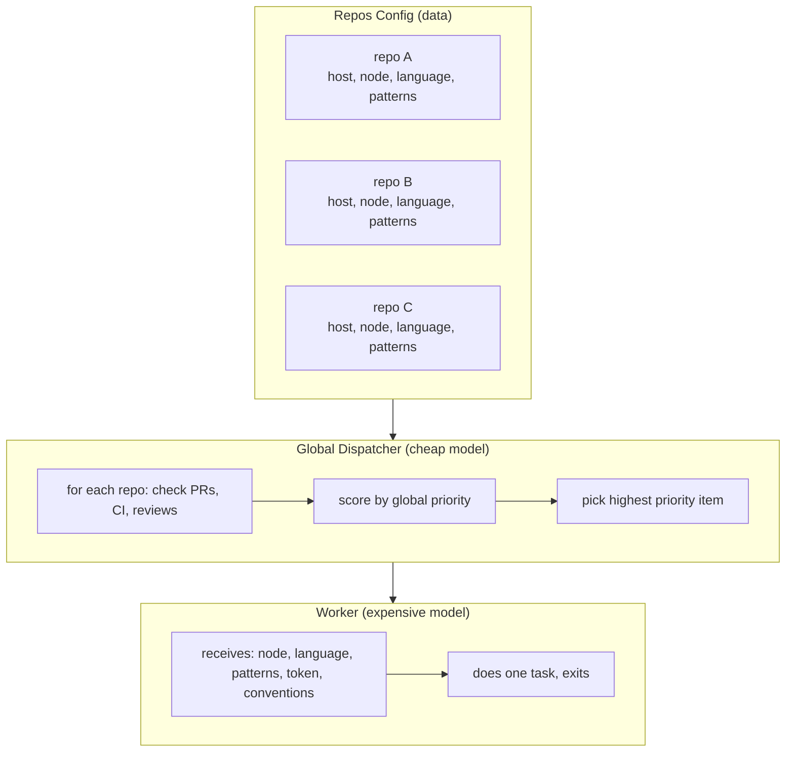

# Scaling to Multiple Repos

The system described in `how-i-work.md` runs against a single repo. Everything — URLs, tokens, node targets, language tooling, issue lists — is baked into cron job prompts. This works. But it doesn't scale.

This document describes what changes when you operate across 2, 5, or 20 repos simultaneously.

---

## What doesn't change

The loops stay the same. The philosophy stays the same. The priority order stays the same. You're still triaging, developing, self-reviewing, twin-reviewing, handing off, auditing, and measuring.

What changes is **where the knowledge lives** and **how the dispatcher routes**.

---

## The core problem

Single-repo: the dispatcher IS the config. URLs, tokens, conventions, and tooling are all in the prompt text.

Multi-repo: the dispatcher needs to be **generic**. It reads a config, iterates repos, picks the highest-priority item globally, then spawns a worker with the right context for that specific repo.

If you keep per-repo dispatchers, 5 repos × 7 loops = 35 cron jobs. Each one fires even when idle. Each one costs a dispatch call. Each one can't see the global picture. This doesn't work.

---

## Architecture: one dispatcher, many repos



---

## Repos config

The dispatcher needs structured knowledge about each repo. This can be a file it reads, an environment variable, or embedded in the prompt — but it must be data, not scattered prose.

```yaml
repos:
  - name: billing-service
    org: acme
    forge: gitea
    host: gitea.example.com
    api: https://gitea.example.com/api/v1
    default_branch: master
    node: build-server       # where to run tests/builds
    language: elixir
    patterns_repo: agent/elixir-patterns
    conventions: CONVENTIONS.md
    tokens:
      read: gitea-read-token
      write: gitea-write-token
    labels:
      ready: 32              # label ID for "ready" (Gitea uses IDs)
    ci_checks:               # expected CI job names
      - test
      - dialyzer
      - lint-docs

  - name: api-gateway
    org: acme
    forge: github
    host: github.com
    api: https://api.github.com
    default_branch: main
    node: cloud-dev          # different node for different repo
    language: go
    patterns_repo: agent/go-patterns
    conventions: CONTRIBUTING.md
    tokens:
      read: github-pat
      write: github-pat
    labels:
      ready: ready           # label name (GitHub uses names, not IDs)
    ci_checks:
      - build
      - test
      - lint

  - name: infra-tools
    org: acme-internal
    forge: github-enterprise
    host: github.corp.example.com
    api: https://github.corp.example.com/api/v3
    default_branch: main
    node: corp-dev
    language: go
    patterns_repo: agent/go-patterns
    conventions: null
    tokens:
      read: ghe-token
      write: ghe-token
    labels:
      ready: ready
    ci_checks:
      - ci
```

---

## WIP limits

Single-repo: WIP = 1, globally. Simple.

Multi-repo needs nuance:

| Rule | Why |
|------|-----|
| Max 1 open PR per repo | Prevents rebase hell within a repo |
| Max 2-3 open PRs globally | Prevents context-switching overload |
| Never 2 PRs in the same repo | The original anti-pattern — exponential rebases |

Parallel PRs across *different* repos are safe because they can't conflict with each other. The danger was always same-repo parallelism.

The dispatcher enforces this:
```
for each repo:
  count open PRs from me
  if count >= 1: skip this repo for new implementation work

total_open = sum of all open PRs from me
if total_open >= max_global_wip: skip all new implementation work
```

Fix/feedback work ignores WIP limits — you always fix broken things regardless of how many PRs are open.

---

## Priority: global, not per-repo

The priority order applies across all repos. A CI failure in repo C is more urgent than a NIT in repo A.

```
1. Merge conflicts      (any repo)
2. CI failures          (any repo)
3. Needs self-review    (any repo)
4. Unaddressed feedback (any repo)
5. Ready for handoff    (any repo)
6. New implementation   (respecting per-repo and global WIP)
```

Within the same priority level, prefer:
- Older items over newer (FIFO)
- Repos with more activity over quiet ones (momentum)
- Smaller tasks over larger ones (throughput)

---

## Workers stay stateless

Workers don't know about the multi-repo architecture. They receive:
- What to do
- Which node to exec on
- Which language/tooling to use
- Which patterns repo to consult
- Which token to use
- Which conventions file to read

They do one thing and exit. The dispatcher is the brain; workers are hands.

---

## Triage report: one view across all repos

Instead of per-repo triage reports, the human sees one unified view:

```
🔀 Triage — Friday May 8

billing-service:
  • #42 — payment retry logic | ✅ ready for merge
  • #44 — docs rebuild | ❌ gpt REQUEST_CHANGES

api-gateway:
  • #15 — health check retry | 🔄 CI running

infra-tools:
  (no open PRs)
```

One message. Everything at a glance. No need to check N different places.

---

## Forge abstraction

Different forges have different APIs:

| Operation | Gitea | GitHub | GitHub Enterprise |
|-----------|-------|--------|-------------------|
| List PRs | `/repos/:org/:repo/pulls` | `/repos/:owner/:repo/pulls` | Same as GitHub |
| CI status | `/repos/.../commits/:sha/status` | `/repos/.../commits/:sha/status` | Same |
| Reviews | `/repos/.../pulls/:n/reviews` | `/repos/.../pulls/:n/reviews` | Same |
| Assign | PATCH `/pulls/:n` with `assignees` | Same | Same |
| Add label | POST `/issues/:n/labels` with `[id]` | POST `/issues/:n/labels` with `["name"]` | Same as GitHub |

The meaningful difference: Gitea labels use IDs, GitHub labels use names. Everything else is close enough that the dispatcher can handle it with a `forge` field switch.

---

## Self-review model rotation

With multiple repos in different languages, self-review model selection can be smarter:

| Dev model | Self-review model | Why |
|-----------|-------------------|-----|
| Opus | Sonnet | Different architecture finds different things |
| GPT-5 | Opus | Cross-provider catches normalized assumptions |
| Sonnet | GPT-5 | Ditto |

Rule: self-review must always use a different model family than whatever wrote the code. "Different model" means different provider or different architecture — not just a different size of the same model.

---

## Lookback scales naturally

The lookback loop already works per-PR. With multiple repos, it just has more data:

- Track per-model AND per-repo effectiveness
- "Sonnet finds more in Elixir than Go" → useful signal
- "GPT-5 catches more in Go concurrency" → useful signal
- Per-repo noise scores reveal which review prompts need tuning for which language

---

## Cron job count: before and after

**Before (per-repo approach for 3 repos):**
- 3 triage jobs
- 3 dev-loop jobs
- 3 post-merge review jobs
- 1 free-time job
- 1 lookback job
- **Total: 11 cron jobs**

**After (global dispatcher approach for 3 repos):**
- 1 triage job (scans all repos)
- 1 dev-loop job (scans all repos, spawns one worker)
- 1 post-merge review job (scans all repos)
- 1 free-time job (picks from any repo)
- 1 lookback job (analyzes all repos)
- **Total: 5 cron jobs**

Same coverage, less overhead, global WIP enforcement built in.

---

## Migration path

You don't rewrite everything at once:

1. **Week 1:** Add repos config file. Dispatcher reads it but still only operates on repo[0].
2. **Week 2:** Extend triage to scan all repos. Dev-loop still single-repo.
3. **Week 3:** Extend dev-loop to route workers to any repo based on priority.
4. **Week 4:** Remove per-repo cron jobs, run fully global.

At each step, the system still works for the original repo. You're adding capability, not replacing it.

---

## What to watch for

**Token sprawl.** Each repo × each forge × each operation = potentially many tokens. Organize them consistently (e.g., `credentials/gitea-write`, `credentials/github-pat`, `credentials/ghe-token`).

**Node contention.** If two repos target the same node, workers can collide (disk space, port conflicts, test databases). Either ensure test isolation or add a per-node concurrency limit.

**Context budget.** The dispatcher prompt grows with each repo. Keep the repos config compact — the dispatcher only needs enough to assess state. Workers get the full context.

**Heterogeneous forges.** GitHub, Gitea, GitLab, Bitbucket — each has quirks. Abstract the 5-6 operations you actually need (list PRs, get CI, get reviews, assign, label, comment) rather than trying to support every API endpoint.

**Different human reviewers.** With multiple repos, handoff might go to different people. Add a `handoff_to` field in the repos config rather than hardcoding one assignee.

---

## Summary

Single-repo is prompt-as-config. Multi-repo is config-as-data with a generic dispatcher.

The loops don't change. The philosophy doesn't change. The priority system doesn't change. What changes is that the dispatcher becomes a router — it reads structured data about all repos, picks the globally highest priority item, and spawns a worker with the right context.

One brain, many hands, shared priorities, no duplication.
