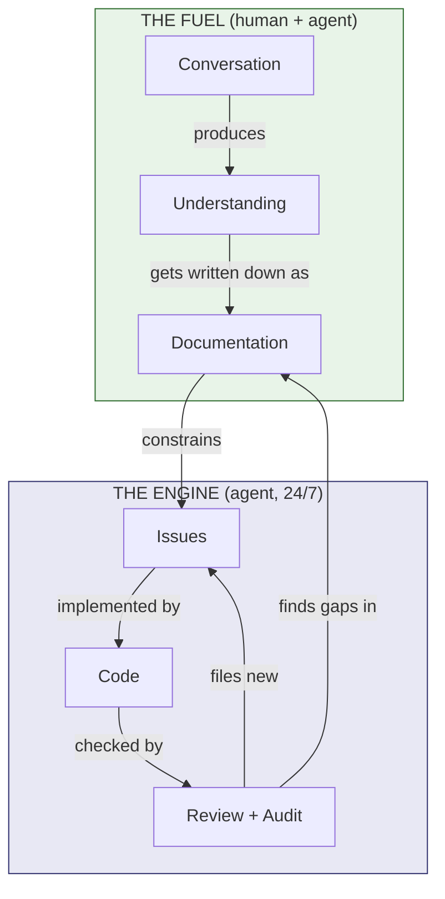

# The Secret Sauce: Why Documentation Drives Everything

The loops described in the [README](README.md) are the engine. This document is about the fuel.

People who try to replicate this system focus on the automation — the cron jobs, the dispatchers, the twin reviews, the post-merge audits. They miss the thing that makes all of it work: **the documentation investment that happens before any code gets written.**

Without it, you have an expensive noise generator. With it, you have an autonomous quality ratchet.



The left side (fuel) is where the human spends most of their time. The right side (engine) is where the agent spends most of its time. The arrows flowing back from audit to documentation are why quality ratchets up — every cycle improves the fuel that drives the next cycle.

---

## The pipeline most people skip

Most teams go: idea → issue → code → review → merge.

This system goes: **conversation → understanding → documentation → issue → code → review → merge → audit.**

The first three steps are where 80% of the value is created. They're also the steps most people skip because they feel like "not real work."

---

## Stage 1: Conversation

Before anything gets documented, there's a conversation. Not "write me a spec" — an actual back-and-forth where two minds (human and agent, or two humans) wrestle with the problem:

- **What IS this thing?** Not what does it do — what is it? A trading system is a state machine where the state is money. Name the essence.
- **What are the forces?** Every design decision exists in tension with others. Find the tensions before you resolve them.
- **What assumptions are we making?** Say them out loud. Write them down. Half of them are wrong — better to discover that now.
- **What would make this wrong?** Try to kill the idea before investing in it. If it survives, it's stronger.

This phase has no deliverable. No document gets written. No issue gets filed. It's pure thinking — and it's the highest-leverage time in the entire process.

**Why it matters for agents:** An agent that skips this phase and jumps to implementation is working from its training data's average understanding of the problem. An agent that went through this phase is working from a *specific, shared, tested* understanding. The difference shows up in every line of code.

---

## Stage 2: Understanding → Documentation

Once the conversation produces clarity, that clarity gets written down. Not as a one-time spec that rots — as living documents that the entire system reads:

**Domain docs** — What the system IS. Bounded contexts, entities, relationships, invariants. "An order cannot exist without a valid instrument." These are facts about the problem domain that survive any rewrite.

**Pattern repos** — How to write code idiomatically. Not style guides (tabs vs spaces) — structural patterns. "GenServer state should be minimal; derived data doesn't belong in state." "Accept interfaces, return structs." These encode architectural taste.

**Conventions files** — How THIS project works specifically. File structure, naming, testing approach, module boundaries. The thing that makes code "fit" vs "bolted on."

**Decision records** — Why we chose X over Y. Six months from now, nobody remembers why. Written down, the reasoning survives and prevents relitigating settled decisions.

Each of these is a **compressed judgment call.** The human thought hard about it once, in full context, with real tradeoffs weighed. The documentation encodes that thinking so it can be applied consistently, forever, without re-derivation.

---

## Stage 3: Issues with teeth

Only after documentation exists do issues get filed. And they're different from typical issues because they have:

- **Clear acceptance criteria** — not "add retry logic" but "retry 3 times with exponential backoff, starting at 100ms, capping at 5s, only on 503/429, with jitter"
- **Domain context** — which bounded context this touches, which invariants must hold
- **What "done" looks like** — specific enough that a machine can audit it post-merge

Vague issues produce vague PRs that can't be reviewed meaningfully. Specific issues produce specific PRs that can be checked mechanically.

---

## The triage gate: don't guess, escalate

Here's a critical piece that makes the autonomous loop safe:

**When triage encounters an issue with ambiguity that can't be resolved from existing documentation, it doesn't guess. It flags the issue for human review.**

The agent's job is to determine: "Can I implement this using only facts already established in the repo?" If the answer is yes — proceed. If the answer is "I'd have to make a judgment call about something not yet decided" — stop and ask.

Examples:

| Situation | Agent decision |
|-----------|---------------|
| Issue says "add retry logic" and patterns repo defines retry conventions | ✅ Proceed — conventions exist |
| Issue says "add caching" but no caching pattern is documented | ⛔ Flag — need human input on caching strategy |
| Issue references a bounded context that's fully specified in domain docs | ✅ Proceed — domain is clear |
| Issue touches two bounded contexts and the boundary isn't defined | ⛔ Flag — boundary decision needed |
| Acceptance criteria are explicit and testable | ✅ Proceed |
| Acceptance criteria say "should feel responsive" | ⛔ Flag — not measurable |

This gate is what makes autonomy safe. The agent doesn't operate on vibes or best guesses. It operates on established facts. When facts don't exist, it says so and asks for them.

**The result:** Every piece of work the agent touches has been pre-validated as "clear enough to implement without judgment calls." The human's time goes to making decisions (high leverage), not reviewing guesses (low leverage).

---

## How documentation compounds

The documentation investment isn't linear — it compounds:

**Session 1:** You spend an hour discussing how orders work. Write it down. Now every future session involving orders starts from shared understanding instead of re-derivation.

**Session 10:** You've documented 5 bounded contexts. New issues that touch those contexts can be implemented autonomously because the rules are clear.

**Session 50:** The patterns repo has 20+ documented patterns. Code review becomes mechanical — "does this follow Pattern 12?" — instead of subjective.

**Session 100:** Post-merge audit can audit against real acceptance criteria from real domain docs. The quality ratchet works because there's something to ratchet against.

Without documentation, session 100 looks like session 1. The agent is still re-deriving the same decisions, still guessing at the same conventions, still producing inconsistent output. There's no compounding because there's nothing to compound on.

**Across projects:** The compounding isn't limited to one repo. Pattern repos and reference docs amortize across *every* project. Build an error-handling pattern guide once — it improves code in every repo that references it. Document how the top open-source projects handle concurrency — that knowledge applies everywhere. Domain docs are per-project, but reference docs are per-ecosystem. That's why the [multi-repo architecture](scaling-multiple-repos.md) works: each new repo starts with the accumulated wisdom of every repo before it, not from scratch.

---

## What "documentation" actually means here

It's not:
- Javadoc comments on every function
- A 200-page architecture document nobody reads
- Confluence pages that rot after creation
- README files that describe how to run the project

It IS:
- **Domain facts** that survive a rewrite ("an order must have a valid instrument")
- **Structural patterns** that encode taste ("errors propagate up; logging happens at boundaries")
- **Decision records** that prevent relitigating ("we chose event sourcing because X, not Y")
- **Conventions** that make code belong ("modules are namespaced by bounded context")
- **Clear boundaries** that prevent scope creep ("the Ledger context never knows about market data")

The test: "Would this fact be useful to a new team member on day 1?" If yes, it belongs in documentation. If it's only useful for the current sprint, it belongs in the issue.

---

## The feedback loop nobody talks about

Documentation isn't write-once. The loops improve it:

**Post-merge audit finds a gap** → "The issue didn't specify behavior for timeout errors" → Update the domain docs to specify timeout semantics → Future issues in that area are more specific → Future PRs handle timeouts correctly from the start.

**Lookback finds noise** → "Reviews keep flagging X but nobody acts on it" → Either X doesn't matter (remove it from patterns) or X matters but isn't understood (improve the documentation of why it matters) → Future reviews are more precise. Note: lookback *recommends* prompt and pattern changes but never applies them autonomously. A human reviews and approves before any review criteria change. Self-modification of the review system requires human oversight. (See [failure modes in the scaling doc](scaling-multiple-repos.md#lookback-self-modification-risk) for the full rationale.)

**Triage flags ambiguity** → Human makes a decision → Decision gets documented → Next time the same question comes up, the agent doesn't need to ask.

**Crucially: triage frequency is a signal about documentation quality.** If the agent keeps flagging ambiguity in the same domain area, that's not the agent being needy — it's the documentation being insufficient. A healthy system sees triage flags *decrease over time* as the documented design fills in gaps. If they're not decreasing, the human isn't investing enough in the conversation and documentation phases. The flags are the metric.

Every cycle through the loops produces documentation improvements. Documentation improvements make future cycles faster and more accurate. This is the compound interest of the system.

---

## Why most AI agent implementations fail

They skip all of this. They point an agent at a repo with:
- No documented conventions (agent guesses at style)
- No domain docs (agent guesses at business logic)
- No patterns (agent uses training-data-average patterns)
- Vague issues (agent interprets creatively)
- No triage gate (agent implements best guesses autonomously)

Then they're surprised when the output is inconsistent, requires heavy review, and doesn't "fit" the codebase. The agent isn't broken. It just has no fuel.

**The uncomfortable truth:** The documentation investment is the hard part. The automation is easy. Anyone can set up cron jobs and API calls. Not everyone can articulate their domain clearly enough that a machine can implement against it without guessing.

---

## What this means for adoption

If you're adopting this system, the loops are step 2. Step 1 is:

1. **Document your domain.** What are the bounded contexts? What are the invariants? What are the entities and their relationships?
2. **Document your patterns.** How do you handle errors? How do you structure modules? What does idiomatic code look like in your stack?
3. **Document your conventions.** How is this specific project organized? What goes where? How are things named?
4. **Write issues with acceptance criteria.** Not "add feature X" but "when Y happens, Z should occur, verified by test W."
5. **Implement the triage gate.** Agent proceeds only when facts support it. Ambiguity goes to the human.

Then turn on the loops. They'll work because they have something to work against.

---

## The ratio

In practice, the time split looks roughly like:

| Activity | Human time | Bot time | Leverage |
|----------|-----------|----------|----------|
| Conversation + thinking | 50% | 5% | Highest — shapes everything downstream |
| Documentation | 15% | 20% | High — amortizes across all future work |
| Issue creation | 5% | 10% | Medium — precision here prevents waste later |
| Implementation | 0% | 40% | Medium — this is where agents shine |
| Review + audit | 30% | 25% | High — closes the loop |

The human barely touches code. Their job is thinking, deciding, and reviewing. The bot barely thinks about the domain. Its job is executing, drafting, and checking.

Read that split carefully: **the human spends 65% of their time on conversation, thinking, and documentation.** The bot spends 65% of its time on implementation and reviews. They're doing fundamentally different work — and that's the point. The human provides understanding; the bot provides throughput.

Most teams spend 80% on implementation and 5% on documentation. Then they wonder why automation doesn't help much. The automation amplifies whatever understanding exists. If the understanding is shallow, the automation produces shallow work at scale.

---

## Reference docs: grounding in reality

There's another layer beyond project documentation that most people miss entirely: **reference documents that ground the agent's knowledge in external reality.**

An LLM has training data. That training data includes millions of opinions about how to write code, how to design systems, how to structure domains. The problem: it's averaged. Ask an agent "write idiomatic Elixir" and you get a blend of blog posts, tutorials, Stack Overflow answers, and production code — weighted by whatever was popular in the training set.

That's not good enough. "Average understanding" produces average code.

### What we actually did

Before writing application code, we built **reference repositories** — curated knowledge extracted from authoritative sources:

**Pattern repos (extracted from top open-source projects):**
- Analyzed the top 10 Elixir projects by sustained engineering (elixir-lang/elixir, phoenix, ecto, etc.)
- Analyzed the top 10 Go projects (kubernetes, etcd, prometheus, etc.)
- Extracted *actual patterns* — not what blogs say is idiomatic, but what battle-tested production code actually does
- Organized by category: error handling, concurrency, testing, module structure, API design
- Compared against official style guides and documented where real practice diverges from aspirational docs

**Theory references (language-agnostic, grounded in literature):**
- Canonical DDD reference — what the terms actually mean per Evans, not "DDD as interpreted by tutorials"
- CQRS/Event Sourcing reference — precise definitions, tradeoffs, when-to-use-what
- Cross-language analysis — what DDD concepts survive contact with specific runtimes (e.g., Elixir/OTP changes how you think about aggregates)

### Why this changes everything

**Without reference docs:** "Write idiomatic Elixir" means "write what the model thinks Elixir looks like based on training data." The agent uses patterns from tutorials, outdated practices, and averaged opinions.

**With reference docs:** "Write idiomatic Elixir" means "write what Phoenix, Ecto, and LiveView actually do in production." The agent is grounded in the same reality that experienced developers know from years of reading source code.

The difference is concrete:

| Without reference docs | With reference docs |
|----------------------|--------------------|
| GenServer with bloated state | GenServer state is minimal — derived data computed on demand (Pattern: phoenix_live_view's assign_new) |
| Generic error handling | Errors propagate up via tuples; logging happens at boundaries only (Pattern: ecto's Repo module) |
| "Accept interfaces" as abstract advice | Specific: io.Reader for input, concrete struct returns, never interface-to-interface (Pattern: kubernetes/client-go) |
| DDD terms used loosely | Aggregate = consistency boundary, not "big object." Bounded context = linguistic boundary, not "microservice" |

### The grounding effect on each loop

**Dev loop:** When the agent writes code, it checks against patterns extracted from *real projects*, not training-data averages. The code comes out looking like it was written by someone who's read the Phoenix source — because in a meaningful sense, it was.

**Self-review:** The reviewer checks against the same reference. "Does this follow the pattern Phoenix uses for channel authentication?" is a checkable question. "Is this idiomatic?" is subjective.

**Twin review:** Reviewers cite specific patterns by name and URL. "This violates the error-handling pattern from ecto (see: patterns/error-handling.md#let-it-crash)." Actionable, verifiable, not a matter of opinion.

**Post-merge audit:** When checking if a PR delivered what it should, the reference docs define what "correct" implementation of a DDD concept looks like. Without that definition, the audit is just guessing.

### Why training data isn't enough

People assume the model "already knows" how to write good code. It does — in the same way a library contains every book. Having the information exist somewhere in weights is not the same as having it actively grounding every decision.

The reference docs do three things training data can't:

1. **Specificity.** Training data says "handle errors." Reference docs say "use tagged tuples `{:ok, result} | {:error, reason}`, never raise for expected failures, pattern match at boundaries, and return the error unchanged through intermediate layers."

2. **Authority.** Training data is popularity-weighted. Reference docs are curated from authoritative sources. The agent follows what *kubernetes actually does*, not what a blog post about kubernetes recommended five years ago.

3. **Consistency.** Training data gives different answers depending on prompt wording. Reference docs give the same answer every time. The agent can't drift because the reference doesn't drift.

### How to build reference docs

You don't write them from scratch. You extract them:

1. **Identify authoritative sources.** For your language/stack, which projects have the longest sustained engineering, most contributors, and best reputation? Those are your sources.

2. **Extract patterns from source code.** Don't read their docs — read their code. Docs describe aspirations. Code describes reality. Where they diverge, trust the code.

3. **Compare against official guidelines.** Some divergences are intentional (the guideline is aspirational). Some are accidental (the guideline is outdated). Note both.

4. **Organize by concern.** Error handling, concurrency, testing, module structure, API design. Not by project — by the *question* the developer has when they're writing code.

5. **Make them citable.** Each pattern gets a URL, a name, a clear example. Review bots should be able to say "see Pattern X" with a link, not just "consider doing it differently."

### The compound effect

Reference docs compound differently from project docs:

- **Project docs** make THIS codebase better.
- **Reference docs** make EVERY codebase better.

Once you've extracted Go patterns from kubernetes, those patterns apply to every Go project you work on. The investment amortizes across repos, across teams, across years. Build them once, use them everywhere.

---

## Summary

The secret sauce isn't the loops. It's what the loops operate on.

Conversations produce understanding. Understanding gets documented. Documentation creates the constraints that make autonomous work possible. Clear constraints make reviews checkable, audits meaningful, and the quality ratchet functional.

Without documentation, you have an agent that writes code. With documentation, you have an agent that writes code *that belongs* — and a system that ensures it keeps belonging, forever.

The loops are the engine. The documentation is the fuel. Invest in both.

---

## The cascade: start at the top, flow down, finish before moving on

There's a discipline that makes all of this work in practice: **architectural changes flow top-down and must complete before new work begins.**

This sounds obvious but almost nobody does it. The natural instinct is: rename something, fix the three files you're looking at, open a PR, move on. The result: half the codebase uses the old name, half uses the new one. Six months later, nobody remembers which is "correct."

The rule: **when you change something at the highest level (domain vocabulary, bounded context boundaries, naming conventions), that change must propagate all the way down to implementation before you pick up any new work.**

### A real example: vocabulary standardization

A project had inconsistent terminology for its escalation system. Different parts of the code used different words for the same concept:

| Before (scattered) | After (standardized) |
|--------------------|----------------------|
| "block" / "halt" / "freeze" | "restrict" |
| "warning" / "flag" / "notice" | "alert" |
| "shutdown" / "unwind" / "close all" | "liquidate" |

The fix wasn't one PR. It was a sequence:

1. **First:** Update the domain taxonomy document. Define the official terms. Get human agreement.
2. **Then:** Update every domain doc that references the old terms.
3. **Then:** Update every implementation doc.
4. **Then:** Update every module, function, variable, test, and comment in the codebase.
5. **Then:** Update the issue templates and acceptance criteria language.
6. **Only then:** Pick up new work.

Each step was its own PR. The sequence was a cascade of small, focused changes — taxonomy first, then docs, then code, then tooling. No new features until the vocabulary was consistent everywhere.

**Why this matters for agents:** An agent that encounters "block" in one file and "restrict" in another will use whichever it saw last. It can't determine which is correct without a canonical source. The taxonomy doc IS that source. But only if it's actually propagated — if the taxonomy says "restrict" but three modules still say "block," the agent will perpetuate the inconsistency.

### The propagation order

```
Level 0: Conversation (agree on the change)
    │
    ▼
Level 1: Domain docs (define the canonical truth)
    │
    ▼
Level 2: Implementation docs (update the how-to guides)
    │
    ▼
Level 3: Code (modules, types, functions, tests)
    │
    ▼
Level 4: Tooling (issue templates, CI checks, review prompts)
    │
    ▼
Level 5: New work begins (everything is consistent)
```

Skipping a level — or starting new work before reaching Level 5 — creates drift. Drift is silent. It compounds. Six months of drift means you've lost vocabulary consistency and you can't trust grep to find all usages of a concept.

### Another example: architectural convention changes

A project decided that all telemetry emission should go through dedicated submodules rather than inline calls. The change was:

1. **Document the convention:** "Every context that emits telemetry gets a `Context.Telemetry` submodule. No inline `:telemetry.execute` calls." Written into the implementation docs.
2. **Create the pattern:** Build one reference implementation showing the correct structure.
3. **File issues for every module that violates the convention.** Not "we'll get to it" — actual tracked issues, each with clear acceptance criteria.
4. **Implement them in sequence.** One PR per module migration. Each one is small, reviewable, and independently correct.
5. **Only when all modules match:** The convention is real. Until then, it's aspirational.

The temptation is to document the convention, migrate two modules, then start a new feature that "follows the new convention." But now you have three styles in the codebase: old modules with inline calls, migrated modules with submodules, and a new module following the convention. An agent reviewing code sees all three and can't determine which is authoritative.

**Finish the migration. Then move on.**

### The stability test

A useful heuristic for what belongs in domain docs vs implementation docs:

> "Would this fact survive a complete rewrite of the internals?"

- "An order must reference a valid instrument" → Yes → domain doc
- "Orders are stored in an ETS table keyed by instrument ID" → No → implementation doc
- "Escalation levels are: alert → restrict → liquidate" → Yes → domain doc
- "The escalation GenServer uses a state machine with three states" → No → implementation doc

This test prevents implementation details from leaking into domain docs. Domain docs are the *stable foundation* that everything else is built on. If they contain implementation details, they rot every time the implementation changes.

### Why "finish before moving on" matters for autonomous agents

Humans can hold context across partially-completed migrations. They remember "oh right, we're in the middle of renaming 'block' to 'restrict', so this old reference is stale." Agents can't. Each session starts fresh.

If the migration is incomplete:
- The agent sees conflicting conventions and can't determine which is current
- Code review becomes ambiguous ("is this a bug or just not-yet-migrated?")
- New code picks up the wrong convention 50% of the time
- The triage gate can't determine if an issue is clear enough to implement (which vocabulary should it use?)

If the migration IS complete:
- Every file uses the same terms
- The canonical source matches reality
- The agent can't accidentally use the old convention because it doesn't exist anywhere
- Reviews are unambiguous ("this doesn't match the documented convention" is checkable)

**Partial migrations are worse than no migration.** A codebase that consistently uses the wrong name is better than one that uses two names for the same thing. At least with one name, grep works.

### The discipline

1. **Never start an architectural change you can't finish this cycle.** If it's too big, break it into smaller changes that are each independently completable.
2. **Domain docs change first.** Always. They're the source of truth. Everything flows from them.
3. **Propagate immediately.** Don't document a rename and "get to the code later." The moment the domain doc merges, the code is wrong. Fix it now.
4. **Block new work until propagation is complete.** This feels expensive. It's cheaper than six months of vocabulary drift.
5. **Grep is your friend.** After the final propagation PR merges, grep the entire repo for the old term. If it appears anywhere — comments, tests, variable names, docs — you're not done.

---

## Tensions and honest answers

The system described above has real tensions. They're worth addressing directly rather than pretending they don't exist.

### Who quality-gates the documentation?

If the conversation phase produces weak documentation, everything downstream degrades — but the system gives you no way to detect that until a post-merge audit finds gaps months later. Right?

Not quite. **Documentation goes through the same review pipeline as code.** Domain doc PRs get twin reviews. Self-review happens. The same severity labels apply. A domain doc with ambiguous vocabulary or internal contradictions gets REQUEST_CHANGES just like a module with unchecked errors.

The test: can the twin reviewers identify a specific, actionable issue with the doc? If the doc is vague enough that a review bot flags "this term is used two ways in the same section" — that's a quality gate catching weak documentation before it merges.

It's not perfect. A doc can be internally consistent but wrong about the domain. That's what the human conversation phase is for — ensuring the documented understanding actually matches reality. But at minimum: documentation quality is reviewed, not assumed.

### Reference docs go stale

"Build them once, use them everywhere" is an overstatement. Kubernetes patterns from three years ago differ from today. Frameworks evolve. Best practices shift.

**The mitigation: periodic refresh.** A scheduled job (weekly or monthly) re-analyzes the source repos and flags divergences from the documented patterns. Not a full re-extraction — a delta check:

- Has the source project changed how it handles errors since our pattern was extracted?
- Are there new patterns in recent commits that we don't document?
- Has an official style guide been updated that contradicts our extracted patterns?

When divergences are found, they surface as recommendations for human review — not automatic updates. The human decides whether the project evolved for good reasons (update our patterns) or whether it's a temporary experiment (keep our patterns as-is).

Reference docs aren't write-once. They're write-once-and-maintain-with-a-scheduled-check.

### The triage gate creates a bottleneck

If the agent flags ambiguity and the human is unavailable for 12 hours, does all work stop?

**No — because unambiguous work still exists.** The triage gate only blocks work that requires undocumented decisions. Meanwhile:

- CI failures get fixed (unambiguous — the test says what's wrong)
- Review feedback gets addressed (unambiguous — the reviewer said what to change)
- Convention migrations continue (unambiguous — the convention is documented)
- Free-time improvements happen (pre-approved category, no human gating)

The bottleneck is real but narrow. It only blocks *new feature implementation* where the domain isn't yet clear. And that's exactly the work you WANT blocked — because implementing against an unclear domain produces code that will be thrown away.

For teams operating across timezones, additional mitigations:

- **Flag batching:** Don't interrupt the human for each flag. Batch them into a daily digest: "3 items need your input before I can proceed."
- **Pre-approved categories:** Free-time work, bug fixes, and convention enforcement don't need the gate. Only new domain work does.
- **Partial resolution:** Sometimes a flag can be resolved by reading existing docs more carefully. The agent should attempt self-resolution (check related domain docs, look for analogous decisions) before escalating. Only truly novel decisions need human input.

### Can the agent build its own fuel?

Yes. And it should.

The initial reference doc extraction — analyzing top open-source projects, extracting patterns, organizing by concern — is exactly the kind of work the agent excels at. It can:

1. **Identify authoritative sources** (sort repos by sustained engineering metrics)
2. **Clone and analyze** (read source, identify patterns, compare to official docs)
3. **Draft the pattern docs** (organize findings, add examples, note divergences)
4. **Submit for human review** (the human validates, the agent writes)

In practice, this is how it actually works: spawn sub-agents (one per source project to avoid crashes from large repos), each extracts patterns from their assigned project, results get assembled into a draft, the human reviews and refines.

The investment isn't "human writes all reference docs." It's "human directs and reviews, agent does the extraction heavy-lifting." That changes the adoption curve from "spend weeks writing docs" to "spend days reviewing docs the agent drafted."

The key constraint: the human must still validate. An agent extracting patterns from Kubernetes will find real patterns — but it might also find historical accidents, deprecated approaches, or conventions specific to that project's unique context. The human's job is to decide what's universal vs what's project-specific.

---
